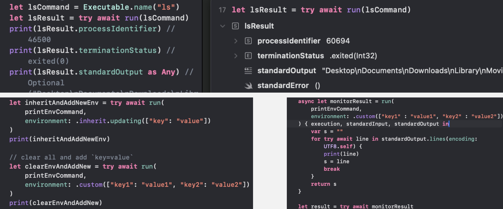

# Swift_SubprocessDemo
A demo of using subprocess package to run terminal command

- Basic
- Custom Stdin, Stdout, Stderr
- Set Arguments, Environment, working directory
- Custom Closure for manually controlling the running process over input and output

